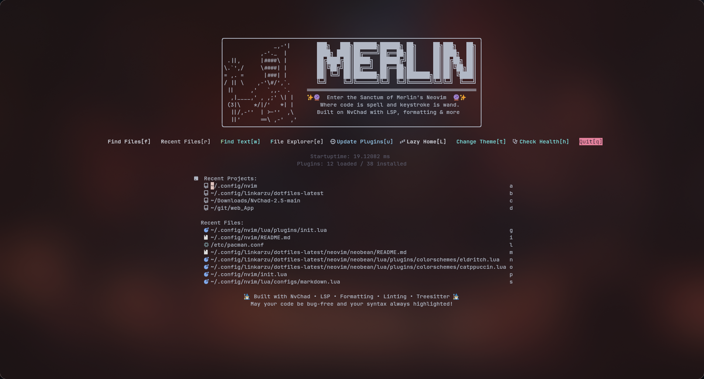
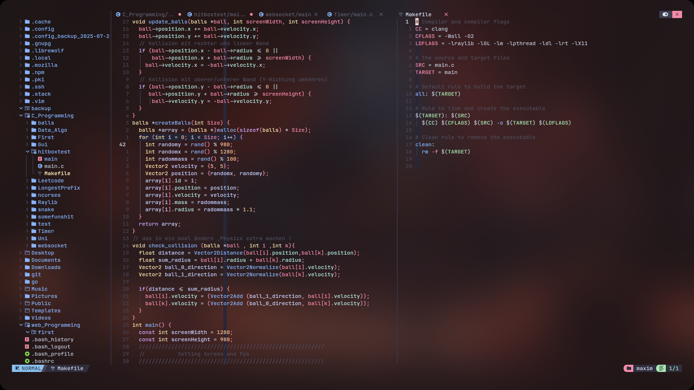

# Merlin's Neovim Configuration

A modern Neovim configuration built on NvChad with LSP, formatting, linting, and syntax highlighting support for multiple programming languages.





## ✨ Features

- **🎨 Theme**: Catppuccin with transparency support
- **🔧 LSP Integration**: Auto-completion, diagnostics, go-to-definition
- **📝 Auto-formatting**: Format on save for all supported languages
- **🔍 Intelligent Linting**: Language-specific error checking
- **🌈 Syntax Highlighting**: Treesitter-powered highlighting
- **📦 Plugin Management**: Lazy.nvim with automatic installation
- **🛠️ Tool Management**: Mason for LSP servers, formatters, and linters

## 🚀 Quick Installation

```bash
# Backup existing configuration
mv ~/.config/nvim ~/.config/nvim.backup 2>/dev/null
mv ~/.local/share/nvim ~/.local/share/nvim.backup 2>/dev/null
mv ~/.local/state/nvim ~/.local/state/nvim.backup 2>/dev/null
mv ~/.cache/nvim ~/.cache/nvim.backup 2>/dev/null

# Clone this repository
git clone https://github.com/Merlinssearch/Merlin_vim.git ~/.config/nvim

# Launch Neovim
nvim
```

On first launch, plugins will automatically install. This may take a few minutes.

## 📋 Prerequisites

### Core Requirements
- **Neovim** 0.9+ (latest stable recommended)
- **Git** (for plugin management)
- **Node.js & npm** (for LSP servers)
- **Python & pip** (for Python-based tools)
- **Rust** (for some formatters and tools)
- **Clipboard support** (xclip for X11, wl-clipboard for Wayland)
- **A Nerd Font** (for icons, see [Nerd Fonts section](#-nerd-fonts))

### Install Core Dependencies

```bash
# Arch Linux / Manjaro
sudo pacman -S --needed neovim unzip luarocks git nodejs npm python python-pip rust

# Ubuntu/Debian
sudo apt update && sudo apt install neovim unzip git nodejs npm python3 python3-pip rustc cargo xclip wl-clipboard

# Fedora
sudo dnf install neovim unzip git nodejs npm python3 python3-pip rust cargo xclip wl-clipboard

# macOS
brew install neovim git node python rust
# Note: Clipboard tools not needed on macOS
```

## 🛠️ Language Support

This configuration supports multiple programming languages. **You can safely remove support for languages you don't use** to avoid installation errors.

### Supported Languages

| Language | LSP Server | Formatter | Linter | Treesitter |
|----------|------------|-----------|---------|------------|
| **Lua** | lua_ls | stylua | luacheck | ✅ |
| **C/C++** | clangd | clang-format | - | ✅ |
| **Go** | gopls | gofumpt, goimports-reviser, golines | - | ✅ |
| **Python** | pyright | black, isort | flake8 | ✅ |
| **JavaScript/TypeScript** | ts_ls | prettier | eslint_d | ✅ |
| **HTML** | html | prettier | - | ✅ |
| **CSS** | cssls | prettier | - | ✅ |
| **Odin** | ols | - | - | ✅ |

### Language-Specific Dependencies

Install tools for the languages you plan to use:

#### Python Development
```bash
pip install --user flake8 black isort
```

#### C/C++ Development
```bash
# Arch/Manjaro
sudo pacman -S clang

# Ubuntu/Debian
sudo apt install clang clang-format

# Fedora
sudo dnf install clang clang-tools-extra
```

#### Lua Development
```bash
# Install via Cargo (requires Rust)
cargo install stylua

# Or install luacheck via luarocks
luarocks install --local luacheck
```

#### JavaScript/TypeScript Development
```bash
npm install -g typescript
```

#### Go Development
```bash
# Arch/Manjaro
sudo pacman -S go

# Ubuntu/Debian
sudo apt install golang-go

# Tools are installed automatically by gopls
```

## ⚠️ Customizing Language Support

**Important**: If you don't plan to use certain languages, comment out their configurations to avoid installation errors.

### Removing Go Support (Example)

Edit these files to comment out Go-related configurations:

**`lua/configs/lspconfig.lua`** - Remove "gopls" from servers list:
```lua
lspconfig.servers = {
    "lua_ls",
    "clangd",
    -- "gopls",  -- Comment out if not using Go
    "pyright",
    -- ... other servers
}
```

**`lua/configs/conform.lua`** - Remove Go formatters:
```lua
formatters_by_ft = {
    lua = { "stylua" },
    -- go = { "gofumpt", "goimports-reviser", "golines" },  -- Comment out
    python = { "isort", "black" },
    -- ... other formatters
},
```

**`lua/configs/treesitter.lua`** - Remove Go parsers:
```lua
ensure_installed = {
    "lua",
    -- "go", "gomod", "gosum", "gotmpl", "gowork",  -- Comment out
    "python",
    -- ... other parsers
},
```

Apply the same pattern for any language you don't need.

## 🎨 Nerd Fonts

This configuration uses icons that require a Nerd Font to display correctly.

### Quick Installation

1. **Download**: Visit [nerdfonts.com](https://www.nerdfonts.com/font-downloads)
2. **Recommended fonts**: FiraCode Nerd Font, JetBrains Mono Nerd Font, or Hack Nerd Font
3. **Install fonts**:
   ```bash
   # Linux
   mkdir -p ~/.local/share/fonts
   cp *.ttf ~/.local/share/fonts/
   fc-cache -fv
   
   # macOS - double-click font files
   # Windows - right-click → Install
   ```
4. **Configure terminal**: Set your terminal to use the Nerd Font

### Terminal Configuration Examples

**Kitty** (`~/.config/kitty/kitty.conf`):
```
font_family FiraCode Nerd Font
```

**Alacritty** (`~/.config/alacritty/alacritty.yml`):
```yaml
font:
  normal:
    family: FiraCode Nerd Font
```

## 🔧 Post-Installation

### Verify Installation

```bash
# Check health
nvim -c "checkhealth" -c "qa"

# Check Mason status
nvim -c "Mason" -c "qa"

# Update everything
nvim -c "Lazy update" -c "MasonUpdate" -c "qa"
```

### Key Mappings

| Key | Mode | Action |
|-----|------|--------|
| `<Space>` | Normal | Leader key |
| `;` | Normal | Command mode |
| `jk` | Insert | Escape to normal mode |
| `<C-s>` | All | Save file (uncomment in mappings.lua) |

More mappings are inherited from NvChad. Check `:help nvchad.mappings`.

## 🐛 Troubleshooting

### Common Issues

#### LSP Not Working
```bash
# Check LSP status
:LspInfo

# Restart LSP
:LspRestart

# Install missing servers
:Mason
```

#### Formatting Issues
```bash
# Check formatters
:ConformInfo

# Manual format
:Format
```

#### Plugin Errors
```bash
# Update plugins
:Lazy update

# Clean and reinstall
:Lazy clean
:Lazy install
```

#### Mason Installation Failures
If tools fail to install for unused languages:
1. Open `:Mason`
2. Find failing tools (marked with ❌)
3. Press `X` to uninstall them
4. Or comment out their configurations

#### Clipboard Issues
If copy/paste doesn't work:
- **X11**: Ensure `xclip` is installed
- **Wayland**: Ensure `wl-clipboard` is installed
- Test with `:checkhealth` for clipboard support

### Getting Help

- `:help` - General Neovim help
- `:checkhealth` - Diagnose configuration issues  
- `:help <plugin-name>` - Plugin-specific help

## 📁 Configuration Structure

```
~/.config/nvim/
├── init.lua                    # Entry point
├── lua/
│   ├── chadrc.lua             # NvChad theme settings
│   ├── options.lua            # Editor options
│   ├── mappings.lua           # Key mappings
│   ├── configs/               # Plugin configurations
│   │   ├── lspconfig.lua      # LSP server setup
│   │   ├── conform.lua        # Formatter setup
│   │   ├── lint.lua           # Linter setup
│   │   ├── treesitter.lua     # Syntax highlighting
│   │   ├── mason-*.lua        # Tool management
│   │   └── lazy.lua           # Plugin manager config
│   └── plugins/
│       └── init.lua           # Plugin definitions
├── .stylua.toml               # Stylua formatter config
└── .eslintrc.json             # ESLint configuration
```

## 🔄 Updates

```bash
# Update plugins
nvim -c "Lazy update" -c "qa"

# Update tools
nvim -c "MasonUpdate" -c "qa"

# Update configuration (pull from git)
cd ~/.config/nvim && git pull  # <-- dont do this without looking in the repo for changes you dont like
```

## 🎯 Minimal Setup

For a lightweight setup with only Lua support (perfect for Neovim config editing):

1. Install: `neovim`, `git`, `nodejs`, `npm`, `rust`, `unzip`, `luarocks`
2. Install stylua: `cargo install stylua`
3. Comment out all other languages in config files
4. Launch Neovim

## 🤝 Contributing

Found a bug or have a suggestion? Please open an issue on GitHub!

## 📄 License

This configuration is open source. Feel free to use and modify as needed.

## 🙏 Acknowledgments

- [NvChad](https://nvchad.com/) - Base configuration framework
- [Lazy.nvim](https://github.com/folke/lazy.nvim) - Plugin manager
- [Mason](https://github.com/williamboman/mason.nvim) - Tool installer
- [Catppuccin](https://github.com/catppuccin/nvim) - Color scheme
- [ProgrammingRainbow](https://github.com/ProgrammingRainbow/NvChad-2.5/tree/main) - nice NvChad config

---

**Tested on**: Arch Linux  
**Should work on**: Any Linux distro, macOS, WSL

If you find solutions for specific distros or encounter issues, please share them in the Issues section to help others! 🚀


----------------------------------------------------

